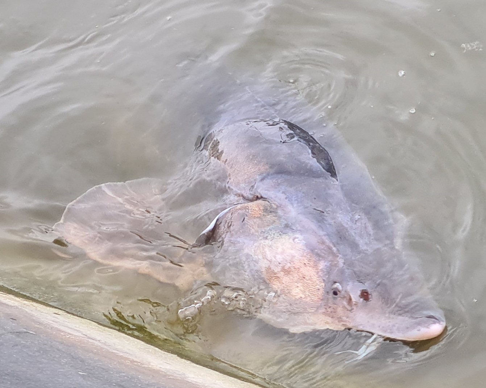

# The Sturgeon Agent-based model for Migration Prediction (StAMP)
The following repository contains the code and files required to run StAMP, a spatially explicit agent-based model which simulates H. huso (beluga sturgeon) reproductive migration movements and population dynamics. This work is described in detail within "Davison, A. M., Honț, Ș., Dorosencu, A., and de Koning, K. (in review). StAMP: An agent-based model to improve monitoring and understanding of beluga sturgeon Huso huso migration and population in the Lower Danube" Further details and DOI for this publication will be shared here when available.

We encourage further use and adaptation of the model for the purposes of increasing knowledge on sturgeon as well as supporting their conservation. 

## File Descriptions
Below you can find a brief description of the files required to run StAMP

**sharing_code_sturgeonABM.R** This is the script to run the ABM itself. It is currently set up in a format to run experiments with different trends over simulated time in the adult population but can be easily altered to simply run with the standard conditions described in the associated paper.

**experiment_sturgeonfunctions.R** This file is the associated library of functions for the ABM.

**River Route Files** There are various csv files I created using ArcGIS software to act as river routes for the sturgeon to follow. These include all files starting "Kilia", "Sfantu_Gheorghe_route", "Sulina_route", "Tulcea_stretch", "mid-bit", "danube_proper", "spawn_branch" and "winter_branch". These are strung together in the ABM script.

**blackseapointsrough.csv** This file was also created using ArcGIS and contains points sampled from an approximated area in the Black Sea surrounding the Danube River mouth.

**Full_Isaccea_EnvData_2024.csv** This is the hydrological data used to run StAMP obtained from the Galati Lower Danube River Administration which can be viewed at https://www.cotele-dunarii.ro/Isaccea

**Starting Population Files** The files "Start_younggroups.csv" and "baseline_standardspawnstart.csv" are used at the start of the model to establish the initial population and their conditions. "newadults36.csv" is used in the event StAMP is being used according to the differing adult population trend experiments in order to establish the increasing adult population. "newmort_baselin_sturpop.csv" is the initial population of adult and subadult sturgeon.

* Files/Data Not Included*

We do not include the files in this repository as they contain sensitive information
**Spawning_sites.csv** and **Wintering_sites.csv** These contain lat, long coordinate information for the spawning and wintering sites in CRS 4326 as well as the index of the river route just before the site
**Location of the YoY Feeding site** This was included was given within the initialisation of the model itself and contained the same information as for the wintering and spawning sites.

